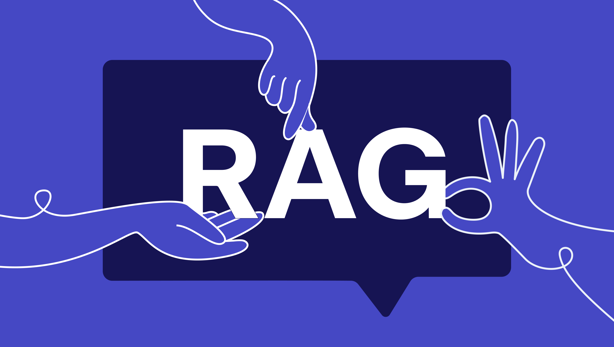
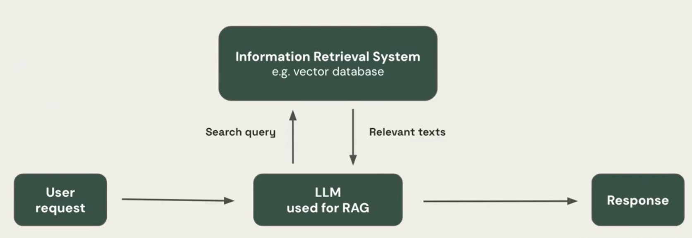

# RAG - RETRIEVAL-AUGMENTED GENERATION

This project is an excerpt from a seminar conducted by Ayush Thakur, a prominent Machine Learning Engineer at Weights & Biases, and Maxim Voisin, a Senior Product Manager at Cohere.

They present a trailer for their upcoming full course titled **"RAG++: Taking Your RAG Beyond Proof of Concept (POC)"**, in collaboration with Weaviate.

If you're unfamiliar with RAG (Retrieval-Augmented Generation), don't worry—we'll explore it throughout this course.

**The project is composed of two parts.**

## Table of Contents

1. [Introduction](#introduction)
   - [Project Overview](#project-overview)
   - [Upcoming Full Course](#upcoming-full-course)
   - [Familiarity with RAG](#familiarity-with-rag)
   - [Project Composition](#project-composition)

2. [Part 1: Flexible RAG: Development and Evaluation Strategies](#part-1-flexible-rag-development-and-evaluation-strategies)
   - 1. [What is RAG?](#what-is-rag)
   - 2. [Benefits of RAG](#benefits-of-rag)
     - 2.1 [More Accurate](#more-accurate)
     - 2.2 [Better at Synthesizing Information](#better-at-synthesizing-information)
     - 2.3 [Adept at Putting Information into Context](#adept-at-putting-information-into-context)
     - 2.4 [Easier to Train](#easier-to-train)
     - 2.5 [More Efficient](#more-efficient)
   - 3. [How is RAG Being Used Today?](#how-is-rag-being-used-today)
     - 3.1 [Improve Customer Support](#improve-customer-support)
     - 3.2 [Generate Content](#generate-content)
     - 3.3 [Perform Market Research](#perform-market-research)
     - 3.4 [Support Sales](#support-sales)
     - 3.5 [Improve Employee Experience](#improve-employee-experience)

3. [Types of RAGs](#types-of-rags)
   - 4.1 [Simple RAG](#simple-rag)
     - i. [Limitation 1: Limited Chunk-Based Understanding](#limitation-1-limited-chunk-based-understanding)
     - ii. [Limitation 2: Difficulty Comparing Information from Multiple Documents](#limitation-2-difficulty-comparing-information-from-multiple-documents)
     - iii. [Limitation 3: Analyzing Complex Data](#limitation-3-analyzing-complex-data)
     - iv. [Limitation 4: Struggles with Complex Questions](#limitation-4-struggles-with-complex-questions)
   - 4.2 [Agentic RAG](#agentic-rag)
     - [Agentic RAG Definition](#agentic-rag-definition)
     - [Agentic RAG Use Case](#agentic-rag-use-case)
     - [Demo: Putting It All Together](#demo-putting-it-all-together)

4. [Part 2: RAG with Use of Cohere and Weaviate](#part-2-rag-with-use-of-cohere-and-weaviate)

5. [References](#references)

---

## Introduction

### Project Overview

This project is an excerpt from a seminar conducted by Ayush Thakur, a prominent Machine Learning Engineer at Weights & Biases, and Maxim Voisin, a Senior Product Manager at Cohere.

### Upcoming Full Course

They present a trailer for their upcoming full course titled **"RAG++: Taking Your RAG Beyond Proof of Concept (POC)"**, in collaboration with Weaviate.

### Familiarity with RAG

If you're unfamiliar with RAG (Retrieval-Augmented Generation), don't worry—we'll explore it throughout this course.

### Project Composition

**The project is composed of two parts.**

---

## Part 1: Flexible RAG: Development and Evaluation Strategies

### 1. What is RAG?

RAG, short for Retrieval-Augmented Generation, works by integrating retrieval-based techniques with generative-based AI models. Retrieval-based models excel at extracting information from pre-existing online sources like newspaper articles, databases, blogs, and other knowledge repositories such as Wikipedia or even internal databases. However, such models cannot produce original or unique responses. Alternatively, generative models can generate original responses that are appropriate within the context of what is being asked, but can find it difficult to maintain strict accuracy. To overcome these relative weaknesses in existing models, RAG was developed to combine their respective strengths and minimize their drawbacks. In a RAG-based AI system, a retrieval model is used to find relevant information from existing information sources while the generative model takes the retrieved information, synthesizes all the data, and shapes it into a coherent and contextually appropriate response.

### 2. Benefits of RAG

By integrating retrieval and generative artificial intelligence (AI) models, RAG delivers responses that are more accurate, relevant, and original while also sounding like they came from humans. That’s because RAG models can understand the context of queries and generate fresh and unique replies by combining the best of both models. By doing this, RAG models are:

#### 2.1 More Accurate
By first using a retrieval model to identify relevant information from existing knowledge sources, the original human-like responses that are subsequently generated are based on more relevant and up-to-date information than a pure generative model.

#### 2.2 Better at Synthesizing Information
By combining retrieval and generative models, RAG can synthesize information from numerous sources and generate fresh responses in a human-like way. This is particularly helpful for more complex queries that require integrating information from multiple sources.

#### 2.3 Adept at Putting Information into Context
Unlike simple retrieval models, RAG can generate responses that are aware of the context of a conversation, and are thus more relevant.

#### 2.4 Easier to Train
Training an NLP-based large language model (LLM) to build a generative AI model requires a tremendous volume of data. Alternatively, RAG models use pre-existing and pre-retrieved knowledge sources, reducing the need to find and ingest massive amounts of training data.

#### 2.5 More Efficient
RAG models can be more efficient than large-scale generative models, as the initial retrieval phase narrows down the context and thus the volume of data that needs to be processed in the generation phase.

### 3. How is RAG Being Used Today?

These are some real-life examples of how RAG models are being used today to:

#### 3.1 Improve Customer Support
RAG can be used to build advanced chatbots or virtual assistants that deliver more personalized and accurate responses to customer queries. This can lead to faster responses, increased operational efficiencies, and eventually, greater customer satisfaction with support experiences.

#### 3.2 Generate Content
RAG can help businesses produce blog posts, articles, product catalogs, or other content by combining its generative capabilities with retrieving information from reliable sources, both external and internal.

#### 3.3 Perform Market Research
By gathering insights from the vast volumes of data available on the internet—such as breaking news, industry research reports, even social media posts—RAG can keep businesses updated on market trends and even analyze competitors’ activities, helping businesses make better decisions.

#### 3.4 Support Sales
RAG can serve as a virtual sales assistant, answering customers’ questions about items in inventory, retrieving product specifications, explaining operating instructions, and in general, assisting in the purchasing lifecycle. By marrying its generative abilities with product catalogs, pricing information, and other data—even customer reviews on social media—RAG can offer personalized recommendations, address customers’ concerns, and improve shopping experiences.

#### 3.5 Improve Employee Experience
RAG can help employees create and share a centralized repository of expert knowledge. By integrating with internal databases and documents, RAG can give employees accurate answers to questions about company operations, benefits, processes, culture, organizational structure, and more.

---

## Types of RAGs

### 4.1 Simple RAG

Simple RAG systems have inherent limitations:

#### i. Limitation 1: Limited Chunk-Based Understanding
Simple RAG systems struggle when the answer isn't confined to just a few chunks or requires understanding the document as a whole.

Examples:
- Summarization
  - User Query: Summarize the key points from Nvidia's latest quarterly earnings report.
- Comprehensive Understanding of the Document
  - User Query: How does Google's letter to shareholders reflect their mission of improving the lives of as many people as possible?

#### ii. Limitation 2: Difficulty Comparing Information from Multiple Documents
Simple RAG systems struggle when the answer requires comparing information from multiple documents.

Example:
- Cross-Analysis
  - User Query: Compare the AI strategies of Google and Microsoft based on these two reports.

#### iii. Limitation 3: Analyzing Complex Data
Simple RAG systems struggle when the answer requires analyzing complex data.

Examples:
- Chat with Spreadsheet or Tabular Data
  - User Query: From the given table, what is the average sales volume for our top 3 products?
- Chat with SaaS Apps
  - User Query: How did our customer churn rate change in the last 3 months?

#### iv. Limitation 4: Struggles with Complex Questions
Simple RAG systems struggle with complex questions, especially those that require multiple steps to answer or involve multiple document references.

Example:
- Multi-Step Reasoning
  - User Query: From this report, which city in Europe would be the best location for our next conference, taking into account the number of attendees, travel costs, and availability of venues?

### 4.2 Agentic RAG

#### Agentic RAG Definition
Agentic RAG can process more complex queries, compare data across multiple documents, and perform multi-step reasoning, making it an ideal solution for more advanced and complicated use cases.

#### Agentic RAG Use Case
Agentic RAG is ideal for businesses that need to conduct comprehensive research, draw insights from complex data, or perform multi-step reasoning to make informed decisions.

#### Demo: Putting It All Together
In this section, you'll find a comprehensive demo showcasing Agentic RAG at work, demonstrating how it tackles a complex query that requires advanced reasoning and data comparison from multiple sources.

---

## Part 2: RAG with Use of Cohere and Weaviate

In this part of the project, we'll delve into how you can build a RAG system using Cohere and Weaviate. We'll walk through the steps of integrating these tools, building your own retrieval-augmented generation system, and optimizing it for different business use cases.

---

## References:

- [Cohere](www.cohere.com)
- [Weights & Biases](www.wandb.com)
- [Cohesity](www.cohesity.com)
- [Kaggle for the dataset](www.kaggle.com)
- [Hyro AI](https://www.hyro.ai/blog/retrieval-augmented-generation-rag-conversational-ai/)
- [RAG: Retrieval-Augmented Generation Paper](https://arxiv.org/abs/2005.11401)

