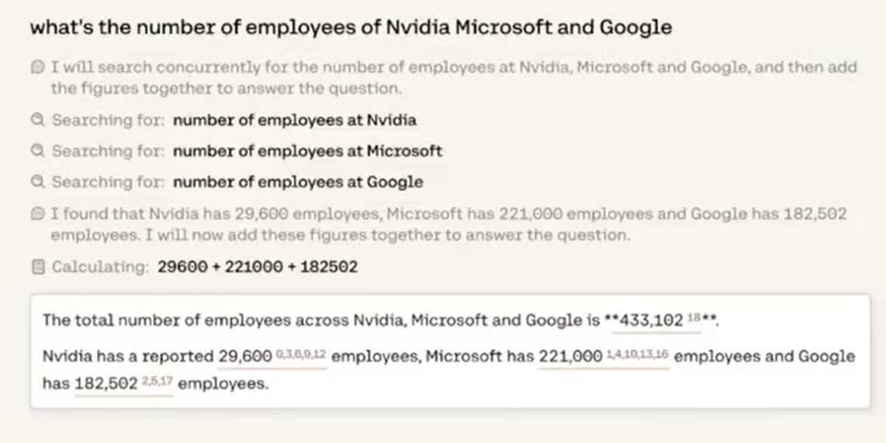
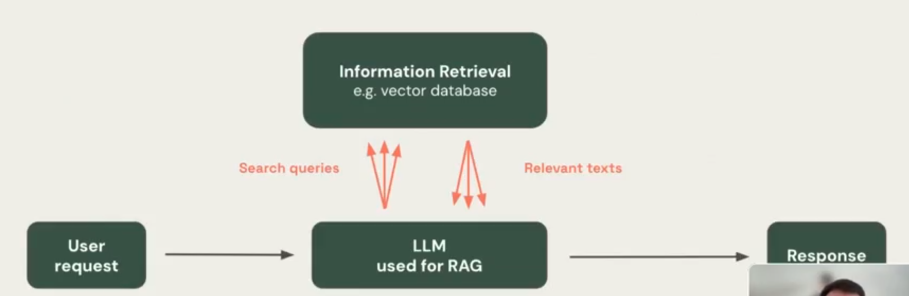
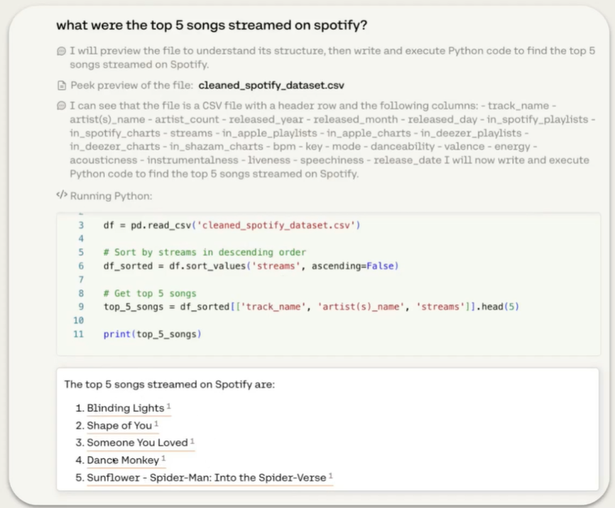

# RAG - RETRIEVIAL AUGMENTED GENERATION

This project is an excerpt from a seminar conducted by Ayush Thakur, a prominent Machine Learning Engineer at Weights & Biases, and Maxim Voisin, a Senior Product Manager at Cohere. 

They present a trailer for their upcoming full course titled **"RAG++: Taking Your RAG Beyond Proof of Concept (POC)"**, in collaboration with Weaviate. 

If you're unfamiliar with RAG (Retrieval-Augmented Generation), don't worry—we'll explore it throughout this course.

**The project is composed of 2 parts**

# **PART 1: Flexible RAG: Development and Evaluation Strategies**
## 1. What is RAG?

RAG, short for Retrieval Augmented Generation, works by integrating retrieval-based techniques with generative-based AI models. Retrieval-based models excel at extracting information from pre-existing online sources like newspaper articles, databases, blogs, and other knowledge repositories such as Wikipedia or even internal databases. However, such models cannot produce original or unique responses. Alternatively, generative models can generate original responses that are appropriate within the context of what is being asked, but can find it difficult to maintain strict accuracy. To overcome these relative weaknesses in existing models, RAG was developed to combine their respective strengths and minimize their drawbacks. In a RAG-based AI system, a retrieval model is used to find relevant information from existing information sources while the generative model takes the retrieved information, synthesizes all the data, and shapes it into a coherent and contextually appropriate response.

## 2. What are the benefits of RAG?
By integrating retrieval and generative artificial intelligence (AI) models, RAG delivers responses that are more accurate, relevant, and original while also sounding like they came from humans. That’s because RAG models can understand the context of queries and generate fresh and unique replies by combining the best of both models. By doing this, RAG models are:

#### 2.1. More accurate
By first using a retrieval model to identify relevant information from existing knowledge sources, the original human-like responses that are subsequently generated are based on more relevant and up-to-date information than a pure generative model.
#### 2.2. Better at synthesizing information
By combining retrieval and generative models, RAG can synthesize information from numerous sources and generate fresh responses in a human-like way. This is particularly helpful for more complex queries that require integrating information from multiple sources.

#### 2.3. Adept at putting information into context
Unlike simple retrieval models, RAG can generate responses that are aware of the context of a conversation, and are thus more relevant.

#### 2.4. Easier to train
Training an NLP-based large language model (LLM) to build a generative AI model requires a tremendous volume of data. Alternatively, RAG models use pre-existing and pre-retrieved knowledge sources, reducing the need to find and ingest massive amounts of training data.

#### 2.5. More efficient
RAG models can be more efficient than large-scale generative models, as the initial retrieval phase narrows down the context and thus the volume of data that needs to be processed in the generation phase.

## 3. How is RAG being used today?
These are some real-life examples of how RAG models are being used today to:

#### 3.1. Improve customer support
RAG can be used to build advanced chatbots or virtual assistants that deliver more personalized and accurate responses to customer queries. This can lead to faster responses, increased operational efficiencies, and eventually, greater customer satisfaction with support experiences.
#### 3.2. Generate content
RAG can help businesses produce blog posts, articles, product catalogs, or other content by combining its generative capabilities with retrieving information from reliable sources, both external and internal.
#### 3.3. Perform market research
By gathering insights from the vast volumes of data available on the internet—such as breaking news, industry research reports, even social media posts—RAG can keep businesses updated on market trends and even analyze competitors’ activities, helping businesses make better decisions.
#### 3.4.Support sales
RAG can serve as a virtual sales assistant, answering customers’ questions about items in inventory, retrieving product specifications, explaining operating instructions, and in general, assisting in the purchasing lifecycle. By marrying its generative abilities with product catalogs, pricing information, and other data—even customer reviews on social media—RAG can offer personalized recommendations, address customers’ concerns, and improve shopping experiences.
#### 3.5. Improve employee experience
RAG can help employees create and share a centralized repository of expert knowledge. By integrating with internal databases and documents, RAG can give employees accurate answers to questions about company operations, benefits, processes, culture, organizational structure, and more.

## 4. Type of RAGs

### 4.1. Simple RAG

It has inherent Limitations.
#### i. Limitation 1:
Simple RAG systems really stuggle when _the answer isn't confined to just a few chunks_ or _requires understanding the document as a whole_.
As an example, let's explore the following cases:
*_Summarization_*
User Query: Summarize the key points from Nvidia's latest quartely earnings report.

*_Comprehensive Understanding of the document_*
User Query: How does Google's letter to shareholders reflects their mission of improving the lives of as many people as possible?

#### ii. Limitation 2:
Simple RAG systems stuggle when the answer requires comparing information from multiple documents.
As an example, let's explore the following cases:
*_Cross-Anaysis_*
User Query: Compare the AI strategies of Google and Microsoft based on these two reports.

#### iii. Limitation 3:
Simple RAG systems stuggle when the answer requires analyzing(Complex data).
As an example, let's explore the following User Queries:
*_Chat with SpreadSheet or Tabular data_*
User Query: From the given table, what is the average sales volume for our top 3 products?

*_Chat with SAAS apps_*
User Query: How did our customer churn rate change in the last 3 months?

#### vi. Limitation 4:
Simple RAG systems stuggle with complex questions
As an example, let's explore the following User Queries:
*_Multi-part questions_*
User Query: What's the number of employees of Nvidia, Microsoft and Google?
*_Sequential Questions_*
User Query: What are the top 3 tech companies in terms of revenue growth, and how many employees do they each have?

Now to overcome some of these limitations, we can use a Flexible RAG, 
#### i. For multi-part questions use _Parallel Queries_:
User Query: What's the number of employees of Nvidia, Microsoft and Google?

#### ii. For Complex data types, use _RAG with Tools_:

User Query 1: From the given table, what is the average sales volume for our top 3 products?
User Query 2: How did our customer churn rate change in the last 3 months?

Instead of always retrieving from a vector db, allow the model to retrieve from any tool.

* retrieve from spreadsheets, using a Python console
* retrieve from the internet, using a search engine
* retrieve from any SaaS app, like a CRM, using APIs
* retrieve from SQL databases, using a code interpreter(e.g. python interpreter for .csv files)

For Sequential Reasoning, use _Agentic RAG_, now let's explore what Agentic RAG is in more details.

### 4.2. Agentic RAG
Agentic RAG refers to a Retrieval-Augmented Generation (RAG) system enhanced with tools that not only generate responses but also transparently display the steps involved in the generation process.

Agentic RAG  =  _RAG with Tools_ + **PLAN**

Example User Query:
What are the top 3 tech companies in terms of revenue growth, and how many employees do they each have?

#### 4.2 Use Case
For use cases that require sequential reasoning, or answering complex questions, let the model:

- plan ahead of time
- do multiple hops of reasoning and tool calls
- self-reflect after each hop

The model can use tools as many times as necessary.

#### 4.3. Demo - Putting it all together

Let's see Agentic RAG on a research and analysis tasks. 

*_The model_*
- plans ahead of time
- executes multiple, sequential steps
- is able to execute parallel queries
- updates the plan based on results from each step
- is able to use tools, e.g. a web browser
- outputs citations because verifiability is built into the heart of our models and come "for free", generated by the LLM itself

# **PART 2: RAG with use of cohere and waive**

## References:

1. [Cohere](www.cohere.com)
2. [Weights & Biases](www.wandb.com)
3. [Cohesity](www.cohesity.com)
4. [Kaggle for the dataset](www.kaggle.com)
5. [Hyro AI](https://www.hyro.ai/blog/retrieval-augmented-generation-rag-conversational-ai/)
